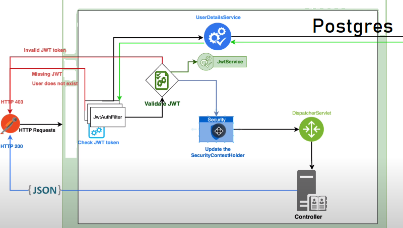
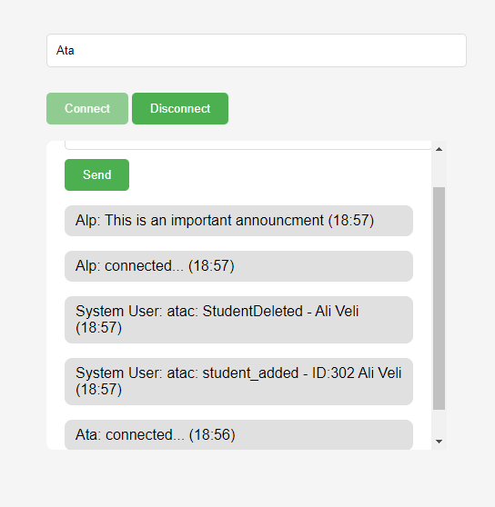
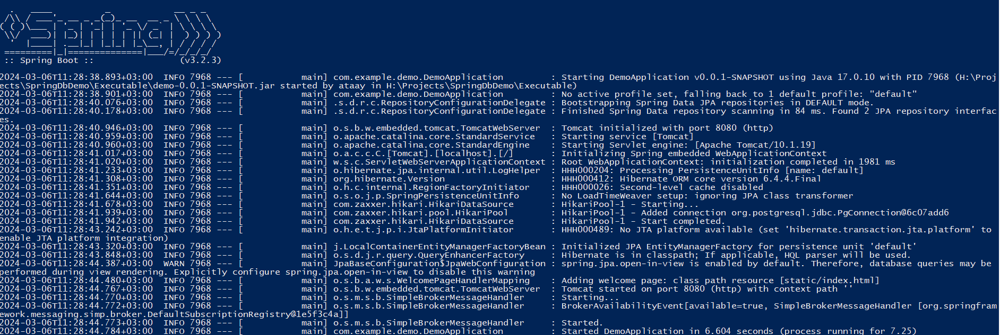

# 🏫School Management Service API 🏫
This school management service provides a robust set of tools to manage your student and school records with authentication system. Student images are saved in local and stored as local path in Db for efficent storage.
This service has a log system to log the changes made to the student and school records with the authenticated user info  also users can send announcements using web sockets.  All the project is made with Spring boot using Postgresql DB

## API Endpoints
### System Endpoints
| Method | URL               | Description                         |
|--------|-------------------|-------------------------------------|
| `GET`  | `/` | Log & Anouncment system.            |
| `POST` | `/login`          | Retrieves a specific student by ID. |
| `POST`  | `/register`       | Retrieves a student's image file.   |


### Student Endpoints
| Method | URL | Description |
|---|---|---|
| `GET` | `/api/v1/student` | Retrieves a list of all students. |
| `GET` | `/api/v1/student/{id}` | Retrieves a specific student by ID. |
| `GET` | `/api/v1/student/image/{id}` | Retrieves a student's image file. |
| `POST` | `/api/v1/student` | Creates a new student (with optional image). |
| `PUT` | `/api/v1/student/{id}` | Updates an existing student (with optional image). |
| `DELETE` | `/api/v1/student/{id}` | Deletes a student. |
| `PUT` | `/api/v1/student/{studentId}/school/{schoolId}` | Assigns a student to a school. |

### School Endpoints

| Method | URL                   | Description                            |
|---|-----------------------|----------------------------------------|
| `GET` | `/api/v1/school`      | Retrieves a list of all schools.       |
| `GET` | `/api/v1/school/{id}` | Retrieves a specific school by its ID. |
| `PUT` | `/api/v1/school/{id}` | Updates an existing school             |
| `DELETE` | `/api/v1/school/{id}` | Deletes a school.                      |
| `POST` | `/api/v1/school` | Creates a new school.                  |

### Authentication 
The app uses JWT for authentication. The user can login or register using the  (/login & /register) endpoints. Logging and registering returns
a JWT token which is used to authorize the user for further requests. The token is valid for 10 hours.

<p align="center">

   

</p>
To make a request to the API, the token should be included in the header as follows:

```bash
Authorization
Bearer <token>
```
Users can use the Log&Chat system without authentication.

### Chat log system
 The app has a chat and log system where users can send   announcements to all the users in the system. 
  System automatically logs the changes made in the DB with the username of the user using the JWT Token .The chat log system is implemented using web sockets. Chat system url : http://localhost:8080/


<p align="center">
  
   
  
</p>

### Testing
The project employs JUnit and Mockito for thorough testing to ensure reliability. The tests cover essential areas within the Student Management system, including:
- Student Repository Tests
- School Repository Tests

To run tests, navigate to the test directory and run the following command:
```bash
mvn test
```

# How to Run
Clone the repository:
```bash
git clone https://github.com/satas20/SchoolManagementService.git
```
Cd into the directory:
```bash
cd SchoolManagementService/Executable
```

Edit the properties file to your database configuration:
```bash
spring.datasource.url=jdbc:postgresql://<target_host>:5432/<database_name>
spring.datasource.username=<username>
spring.datasource.password=<password>
```

Run the project:
```bash
java -jar SchoolManagementService.jar
```
Navigate to your browser and go to the specified port  (default: 8080) for the Log & Chat system or you can start making API web requests.
```
http://localhost:8080/
```
Success! You are now running the School Management Service.


<p align="center">
  
</p>
